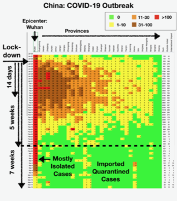

# Spread knowledge, not the virus

### The focus of our work is to provide relevant information that leads to pragmatic actions for single individuals, employers, governments and NGOs. 

_I am an MIT-trained physicist and complexity scientist who studies pandemics. I have warned about global pandemics due to increasing travel for 15 years. I recommended community-based monitoring of symptoms to stop Ebola in West Africa in 2014, and it worked. The fastest and even the only way to stop COVID-19 in the United States is a five-week national lockdown._

||
|NECSI President, Prof. Yaneer Bar-Yam|
| --- |

### The key to stopping the spread of the virus is to lower connectivity

Every time the virus does not infect another person, it has a massive impact on reducing the growth of overall infections. The better informed we all are on the actions we can take, the better we will serve our most vulnerable loved ones and our healthcare infrastructure at large.

Without intervention, it is estimated that an individual with the virus will infect on average 3-4 other people, resulting in an exponential increase in the number of cases over time. If social connectivity can be lowered such that the average number of people that an individual with the virus infects is less than one other person, the number of cases will exponentially decrease over time instead.

Stay informed with the latest news on preventing and defeating the spread of COVID-19, written and published by experts in the field.

### Join the fight against COVID-19

(LINK TO SIGNUP PAGE)

## Recommendations

### Lockdowns

In much of Europe and North America, the explosive growth of COVID-19 means that a 4-6 week strong lockdown is necessary to stop the outbreak. Such lockdowns may be politically difficult to implement and they always entail significant short-term economic and social costs. But their effects are dramatic and their duration is short. Two months after China imposed its lockdown, China has virtually eliminated local transmission of COVID-19. Wuhan is now safer than London or New York, and China’s economy is on the path to recovery. Without China’s strict lockdown, the economic harm to China from COVID-19 would have been orders of magnitude greater.

During a strong lockdown individuals stay home except to obtain food and other essentials, access medical care, or do work essential to the functioning of society. Governments provide economic and social aid to citizens who need it.

[Why 4-6 weeks?]()  During the first two weeks of the lockdown, those who are already infected will show symptoms. This “incubation period” typically takes 3-5 days, but may take as long as two weeks. Infected individuals will recover from mild COVID-19 cases or seek medical care. The only people who can be infected are those who are cohabitating with a previously infected individual. Since we know which individuals are infected, due to symptoms and testing, we know who can be infected and can isolate them so they don’t infect others (this is called contact tracing).

During the 3-4 weeks that follow, any newly infected family or cohabitants of infected individuals will recover or seek medical attention. Once they are isolated, they cannot infect others. The number of cases will decrease rapidly. By the end of the lockdown, COVID-19 cases will be a small fraction of what they once were. This is exactly what happened in China.

The lockdown also gives time to dramatically scale up the supply of COVID-19 test kits and capacity to process them. If the number of infections is dramatically reduced using the lockdown and a massive testing regime is initiated, COVID-19 can be controlled after five weeks without extreme social distancing measures. Isolating sick individuals and their immediate contacts will be enough. This is what has been done to control the outbreak for a few cases in Singapore.

The case of Italy can serve as a warning about attempting a “soft” lockdown. Italy's lockdown measures were insufficiently strict---many Italians flouted movement restrictions and continued spreading COVID-19. The disease continued to grow exponentially. Italy is strengthening its lockdown procedures to prevent further spread. Denmark, which has a more complete lockdown and closed its borders, has been much more successful at curtailing its outbreak.

### Massive Testing, Contact Tracing, and Isolation

Massive testing for COVID-19 combined with tracing and then isolating the contacts of infected individuals is the intervention that causes the least amount of economic harm and yet saves many lives. Singapore and Korea have shown that this approach can defeat COVID-19.

Governments must employ the following strategies to stop COVID-19:

1. Contact Tracing: Isolate, monitor and test everyone who has been in contact with a known infected individual.

2. Generic Symptomatic Testing: Test everyone in the geographic area of an infected individual for COVID-19 symptoms such as fever.

3. Targeted Sampling: Randomly test individuals in high-risk populations such as prisons, nursing homes, and student dormitories.

Countries, especially in Asia, that have the requisite expertise should help the rest of the world get up to speed. Contact tracing teams must be trained and countries must rapidly ramp up testing. Countries should use testing capacity in academic institutions and corporations.

### Restricting Mobility While Allowing Essential Supplies and the Medical Response

Travel from areas with active outbreaks should be stopped, every individual should undergo a 14 day quarantine when entering into other areas. Where active outbreaks are occurring, limiting mobility to essential travel enables areas with fewer cases gain control of their outbreaks faster and with more limited interventions. The ability to recover quicker is important for economic recovery and for the ability to help areas that are more severely affected.

||
| --- |

## [Family guidelines](https://github.com/necsi/source-translation-text/blob/master/0_english_source/pdf/family_en.pdf)
## [Community guidelines](https://github.com/necsi/source-translation-text/blob/master/0_english_source/pdf/individual_community_government_en.pdf)
## [Government guidelines](https://github.com/necsi/source-translation-text/blob/master/0_english_source/pdf/individual_community_government_en.pdf)

